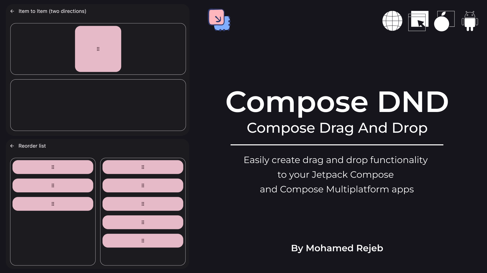

# Compose Drag And Drop

Compose DND is a library that allows you to easily add drag and drop functionality to your Jetpack Compose or Compose Multiplatform projects.


[](http://kotlinlang.org)
[](https://github.com/MohamedRejeb)
[](https://opensource.org/licenses/Apache-2.0)
[](https://github.com/MohamedRejeb/compose-dnd/actions)
[](https://search.maven.org/search?q=g:%22com.mohamedrejeb.dnd%22%20AND%20a:%compose-dnd%22)



## Installation

[](https://search.maven.org/search?q=g:%22com.mohamedrejeb.dnd%22%20AND%20a:%compose-dnd%22)

Add the following dependency to your module `build.gradle.kts` file:

```kotlin
implementation("com.mohamedrejeb.dnd:compose-dnd:0.1.0")
```

## Usage

### Drag and Drop

To implement drag and drop functionality:
- Create a `DragAndDropState` with `rememberDragAndDropState`.

```kotlin
val dragAndDropState = rememberDragAndDropState()
```
<br>

- Add `DragAndDropContainer` composable which will wrap the draggable items.

```kotlin
DragAndDropContainer(
    state = dragAndDropState,
) {

}
```
<br>

- Add `DraggableItem` composable for each draggable item.

```kotlin
DraggableItem(
    state = dragAndDropState,
    key = task.id, // Unique key for each draggable item
    data = task, // Data to be passed to the drop target
) {

}
```
<br>

- Add `Modifier.dropTarget` for each drop target.

```kotlin
Modifier.dropTarget(
    state = dragAndDropState,
    key = task.id, // Unique key for each drop target
    onDrop = { state -> // Data passed from the draggable item
        // Handle drop
    }
)
```

> For more details, check out the [sample](https://github.com/MohamedRejeb/compose-dnd/tree/main/sample/common/src/commonMain/kotlin)

### Reorder List

To implement reorder list functionality:

- Create a `ReorderState` with `rememberReorderState`.

```kotlin
val reorderState = rememberReorderState()
```
<br>

- Add `ReorderContainer` composable which will wrap the reorderable items.

```kotlin
ReorderContainer(
    state = reorderState,
) {

}
```
<br>

- Add `ReorderableItem` composable for each reorderable item.

```kotlin
ReorderableItem(
    state = reorderState,
    key = task.id, // Unique key for each reorderable item
    data = task, // Data to be passed to the drop target
    onDrop = { state -> // Data passed from the draggable item
        // Handle drop
    }
) {

}
```

The `ReorderableItem` composable is at the same time a `DraggableItem` and a `dropTarget`. <br><br>

> For more details, check out the [sample](https://github.com/MohamedRejeb/compose-dnd/tree/main/sample/common/src/commonMain/kotlin)


### Toggleable Drag and Drop

If you want the ability to toggle drag and drop functionality, you can use the
`ToggleableDragAndDropContainer` or `ToggleableReorderContainer` composable. Then use the scoped
item composable `ToggleableDragAndDropContainerScope.DraggableItem` or
`ToggleableReorderContainerScope.ReorderableItem`.

For `DragAndDropContainer`:

```kotlin
val dragAndDropState = rememberDragAndDropState()
var enabled by remember { mutableStateOf(false) }

ToggleableDragAndDropContainer(
    state = dragAndDropState,
    enabled = enabled,
) {
    DraggableItem(
        // ...
    ) {
        // Draggable item content
    }
}
```

For `ReorderContainer`:

```kotlin
val reorderState = rememberReorderState()
var enabled by remember { mutableStateOf(false) }

ToggleableReorderContainer(
    state = reorderState,
    enabled = enabled,
) {
    ReorderableItem(
        // ...
    ) {
        // Reorderable item content
    }
}
```

## Contribution
If you've found an error in this sample, please file an issue. <br>
Feel free to help out by sending a pull request :heart:.

[Code of Conduct](https://github.com/MohamedRejeb/compose-dnd/blob/main/CODE_OF_CONDUCT.md)

## Find this library useful? :heart:
Support it by joining __[stargazers](https://github.com/MohamedRejeb/compose-dnd/stargazers)__ for this repository. :star: <br>
Also, __[follow me](https://github.com/MohamedRejeb)__ on GitHub for more libraries! 🤩

You can always <a href="https://www.buymeacoffee.com/MohamedRejeb"></a>

# License
```
Copyright 2023 Mohamed Rejeb

Licensed under the Apache License, Version 2.0 (the "License");
you may not use this file except in compliance with the License.
You may obtain a copy of the License at

   http://www.apache.org/licenses/LICENSE-2.0

Unless required by applicable law or agreed to in writing, software
distributed under the License is distributed on an "AS IS" BASIS,
WITHOUT WARRANTIES OR CONDITIONS OF ANY KIND, either express or implied.
See the License for the specific language governing permissions and
limitations under the License.
```
