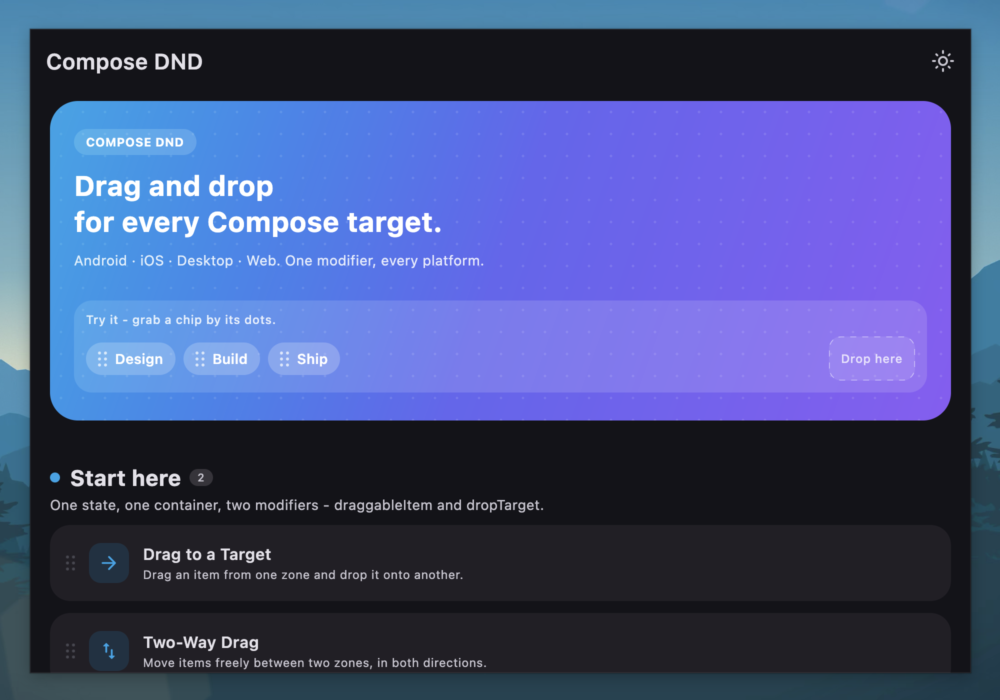

# Compose DND

A library that allows you to easily add drag and drop functionality to your Jetpack Compose or Compose Multiplatform projects.

[](http://kotlinlang.org)
[](https://www.jetbrains.com/lp/compose-multiplatform)
[](https://opensource.org/licenses/Apache-2.0)
[](https://search.maven.org/search?q=g:%22com.mohamedrejeb.dnd%22%20AND%20a:%22compose-dnd%22)



## Features

- **Drag and Drop** -- Drag items from one location and drop them onto designated targets.
- **Reorder Lists** -- Reorder items within a list using drag and drop gestures.
- **Auto Scroll** -- Automatically scroll containers when dragging items near edges.
- **Drop Strategies** -- Choose from multiple built-in strategies to determine which drop target receives the dragged item.
- **Drag Handle** -- Restrict the drag gesture to a specific handle area within the item.
- **Axis Lock** -- Constrain dragging to the horizontal or vertical axis.
- **Conditional Drop** -- Control which drop targets accept which dragged items.
- **Drop Animation** -- Smooth spring-based animations when items are dropped.
- **Custom Drag Shadow** -- Provide a custom composable to display while an item is being dragged.
- **Enable/Disable** -- Toggle drag and drop at the container level or per item.

## Platform Support

| Platform | Supported |
|----------|-----------|
| Android  | Yes       |
| iOS      | Yes       |
| Desktop  | Yes       |
| Web (JS) | Yes       |
| Web (WASM) | Yes     |

## Quick Start

Add the dependency to your module `build.gradle.kts`:

```kotlin
implementation("com.mohamedrejeb.dnd:compose-dnd:{{ compose_dnd_version }}")
```

Then use it in your Composable:

```kotlin
val dragAndDropState = rememberDragAndDropState<String>()

DragAndDropContainer(
    state = dragAndDropState,
) {
    val isDragging = dragAndDropState.isDragging("item-1")

    Text(
        text = "Drag me",
        modifier = Modifier
            .graphicsLayer { alpha = if (isDragging) 0f else 1f }
            .draggableItem(
                key = "item-1",
                data = "Hello",
                state = dragAndDropState,
                draggableContent = {
                    Text("Drag me") // Shown as the drag shadow
                },
            ),
    )

    Box(
        modifier = Modifier
            .dropTarget(
                key = "target-1",
                state = dragAndDropState,
                onDrop = { state ->
                    println("Dropped: ${state.data}")
                },
            )
    ) {
        Text("Drop here")
    }
}
```

For more details, see the [Drag and Drop Overview](drag-and-drop/overview.md) or check out the [sample project](https://github.com/MohamedRejeb/compose-dnd/tree/main/sample/common/src/commonMain/kotlin).

## Contribution

If you have found an error in this library, please file an [issue](https://github.com/MohamedRejeb/compose-dnd/issues).

Feel free to help out by sending a pull request.

[Code of Conduct](code_of_conduct.md)

## Find this library useful?

Support it by joining [stargazers](https://github.com/MohamedRejeb/compose-dnd/stargazers) for this repository.

Also, [follow Mohamed Rejeb](https://github.com/MohamedRejeb) on GitHub for more libraries.

## License

```
Copyright 2023 Mohamed Rejeb

Licensed under the Apache License, Version 2.0 (the "License");
you may not use this file except in compliance with the License.
You may obtain a copy of the License at

   http://www.apache.org/licenses/LICENSE-2.0

Unless required by applicable law or agreed to in writing, software
distributed under the License is distributed on an "AS IS" BASIS,
WITHOUT WARRANTIES OR CONDITIONS OF ANY KIND, either express or implied.
See the License for the specific language governing permissions and
limitations under the License.
```
